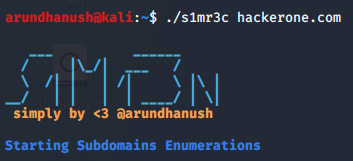

# s1mr3c

Simple Recon Tool Just here automates your fav tools set. this my first try :) so avoid if anything weird!

#Installation

Must have this tools in /usr/local/bin with all permissions.

1. [subfinder](https://github.com/projectdiscovery/subfinder)
2. [httprobe](https://github.com/tomnomnom/httprobe)
3. [aquatone](https://github.com/michenriksen/aquatone)
4. [subzy](https://github.com/LukaSikic/subzy)
5. [Waybackurls](https://github.com/tomnomnom/waybackurls)
6. [gf](https://github.com/tomnomnom/gf)
7. [qsrepalce](https://github.com/tomnomnom/qsreplace)
8. [gobuster](https://github.com/OJ/gobuster)

Easy to install those tools, i guess just you face the errors on while install [gf](https://github.com/tomnomnom/gf) watch how install gf 
then install it correctly.

save those tools in /usr/local/bin and you can modify the tool like run your fav tool there easy to change it.

#Usage

git clone https://github.com/arundhanush-r/s1mr3c.git

cd s1mr3c

chmod +X s1mr3c

./s1mr3c example.com

#Thank all
:) 
[Twitter](https://twitter.com/arundhanush_r)
[Instagram](https://instagram.com/arundhanush_r)

