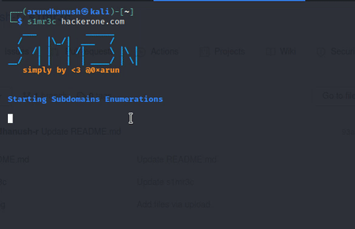

# s1mr3c

Simple Recon Tool Just here automates your fav tools set. this my first try :) so avoid if anything weird!

# Installation

Must have this tools in /usr/local/bin with all permissions.

1. [subfinder](https://github.com/projectdiscovery/subfinder)
2. [httprobe](https://github.com/tomnomnom/httprobe)
3. [aquatone](https://github.com/michenriksen/aquatone)
4. [subzy](https://github.com/LukaSikic/subzy)
5. [Waybackurls](https://github.com/tomnomnom/waybackurls)
6. [gf](https://github.com/tomnomnom/gf)
7. [Gf-Patterns](https://github.com/1ndianl33t/Gf-Patterns)
8. [sqlmap](https://github.com/sqlmapproject/sqlmap)
7. [qsrepalce](https://github.com/tomnomnom/qsreplace)
8. [gobuster](https://github.com/OJ/gobuster)

#Important

Easy to install those tools or else you may get any errors while this install this tools let use my Drive link download the zip file extract then copy those tools to save /usr/local/bin  

https://drive.google.com/file/d/1QMqixoF05vVHurR3veG9tVmMZXtHJsgQ/view?usp=sharing

if sqlmap takes time you can stop it crtl + c then Namp starts!

Get any error like "unable to locate chorme" with aquatone just install chrome browser!

can you easily modify the code as well as run your's fav tool.

# Usage

git clone https://github.com/arundhanush-r/s1mr3c.git

cd s1mr3c

chmod +X s1mr3c

./s1mr3c example.com

# Thank all
:) 
[Twitter](https://twitter.com/0xarun)
[Instagram](https://instagram.com/0xarun)

